# AMIMIR_frontend
### Link a la página
https://beautiful-bombolone-66a0df.netlify.app/

## Descripción general
* ¿De qué se tratará el proyecto?

El proyecto consistirá en crear una red social para fanáticos del cine. En la página web los usuarios podrán compartir sus opiniones sobre películas, rankearlas, crear playlists de películas e incluso crear parties para ver películas con sus amigos. Además, los usuarios podrán seguirse entre ellos y chatear. 

* ¿Cuál es el fin o la utilidad del proyecto? 

Este proyecto es una red social de películas que proporciona una plataforma integral para que los amantes del cine interactúen, descubran nuevas películas, compartan sus opiniones y exploren el mundo del cine de manera colaborativa. En esta plataforma se pueden descubrir nuevas películas gracias a las críticas y recomendaciones de otros miembros de la comunidad, puedes realizar un seguimiento de tus películas vistas, puedes crear listas personalizadas que te permiten planificar las películas que veras después, los usuarios pueden escribir críticas y reseñas de películas lo cual permite a los usuarios que están considerando ver cierta película tener una fuente de información y también se puede recomendar películas a otros miembros de la comunidad. 

* ¿Quiénes son los usuarios objetivo de su aplicación? 

Los usuarios objetivos son personas que sean amantes de las películas, es decir cinéfilos, y que quieren conectar con otras personas que disfrutan de los mismos gustos. 

## Historias de usuario
* Usuario administrador:
1. “Como administrador, quiero publicar películas, para que los usuarios puedan interactuar con ellas”. 

2. “Como administrador, quiero poder eliminar comentarios inapropiados, para mantener el respeto dentro de la página”. 

3. “Como administrador, quiero poder darle la verificación a un usuario, para que los otros usuarios sepan que el usuario tiene la verificación”. 

4. “Como administrador, quiero poder editar la información de una película, para asegurar que la información sea correcta”. 

5. “Como administrador, quiero poder eliminar una review o comentario de una película, para que se mantenga el código de conducta de la página”. 

* Usuario loggeado:
1. “Como usuario loggeado, quiero seguir a otros usuarios para poder ver que películas les gustan a ellos”. 

2. “Como usuario loggeado, quiero acceder a la información y ranking de las películas publicadas para poder informarme acerca de estas”. 

3. “Como usuario loggeado, quiero agregar una película a una de mis playlists, para mantener un registro de las películas que he visto” 

4. “Como usuario loggeado, quiero crear playlists para ordenar y clasificar las películas que quiero ver” 

5. “Como usuario loggeado, quiero poder publicar mi review de una película, para poder expresar mi opinión con el resto de las personas”. 

6. “Como usuario loggeado, quiero comentar una review para compartir o debatir las opiniones de otro usuario.” 

7. “Como usuario loggeado, quiero poder editar mi perfil, para que me represente adecuadamente”. 

8. “Como usuario loggeado, quiero chatear con mis seguidores, para poder interactuar con mis amigos”. 

9. “Como usuario loggeado, quiero poder editar mi review o comentario, para poder enmendar mis errores”. 

10. “Como usuario loggeado, quiero poder eliminar mis comentarios y reviews, para no tener publicaciones que ya no me representen.     

* Usuario visita:
1. “Como usuario visita, quiero poder crear una cuenta, para obtener todas las funcionalidades de la página”. 

2. “Como usuario visita, quiero acceder a la información y ranking de las películas publicadas para poder informarme acerca de estas”. 

3. “Como usuario visita, quiero poder tener acceso a la información de la página, como su propósito, quiénes son los creadores, y cómo puedo contactarlos, entre otros detalles relevantes”. 

## Diagrama Entidad-Relación
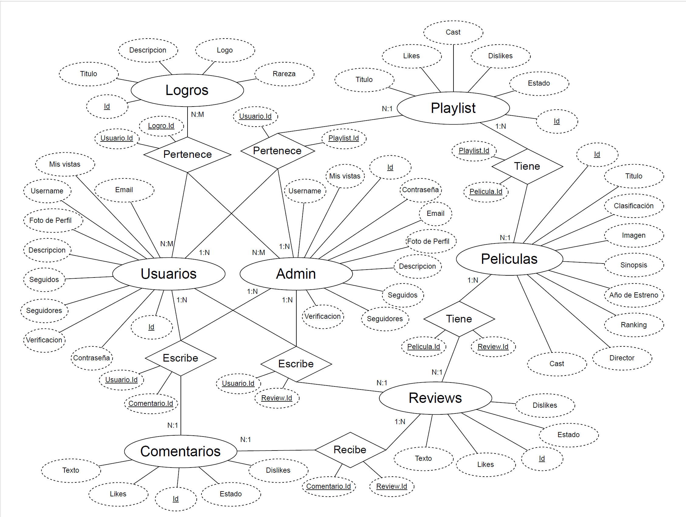

## Diseño Web
### Vistas principales y ejemplos de aplicación
### Vistas Landing Page
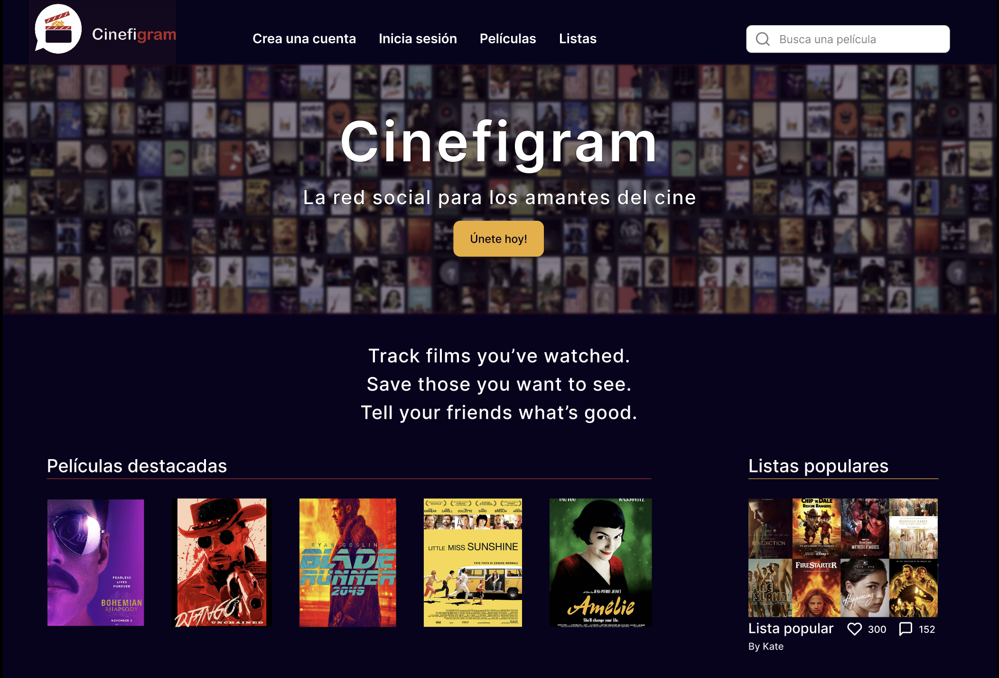

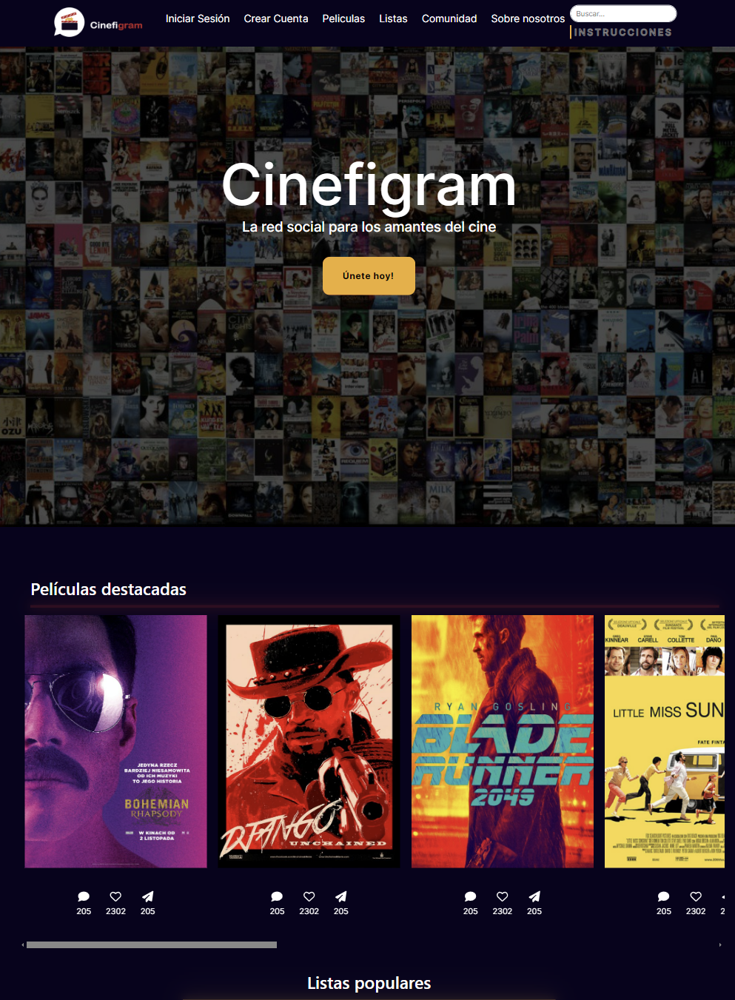

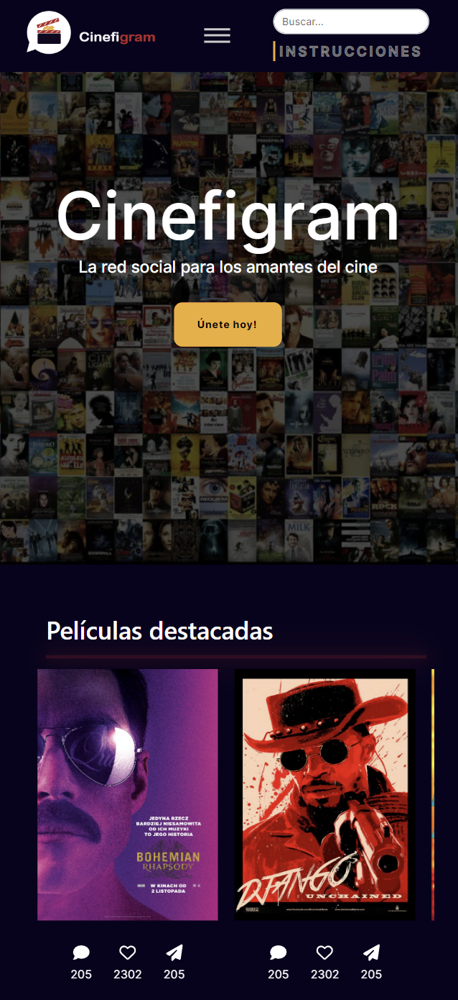

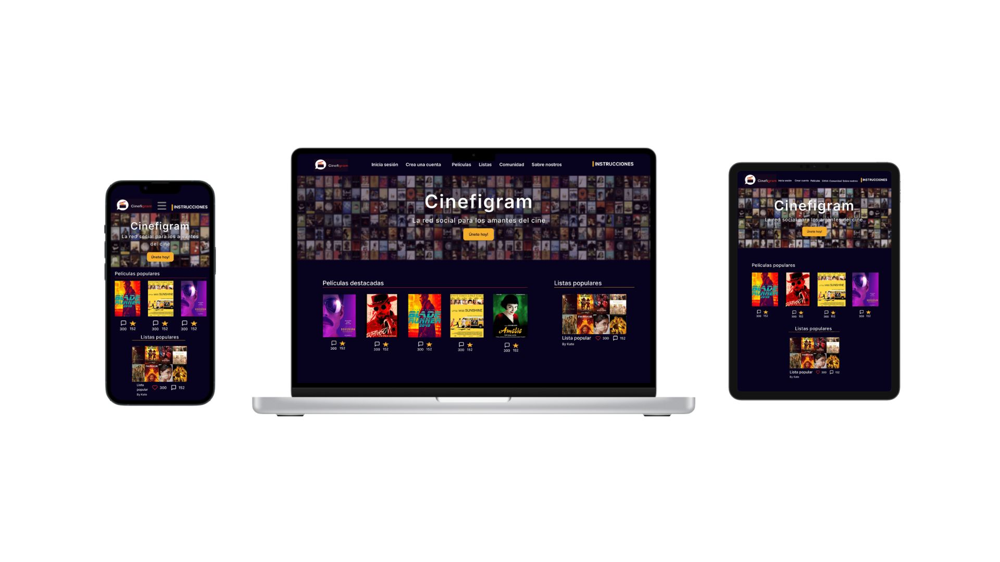

### Vistas Profile Page

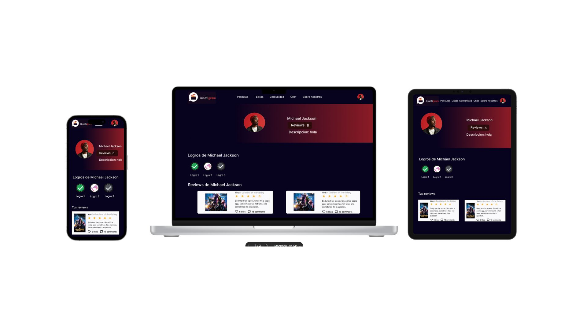

### Vistas Login Page

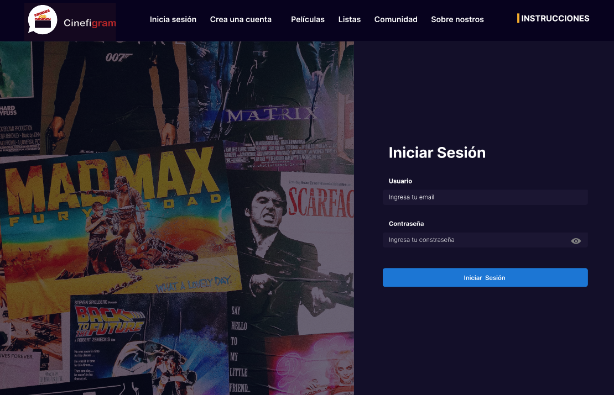

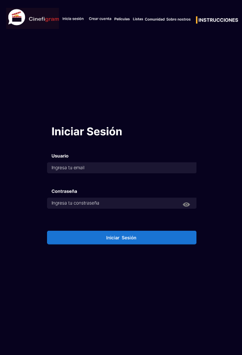

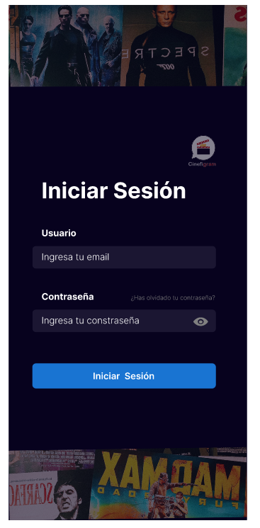

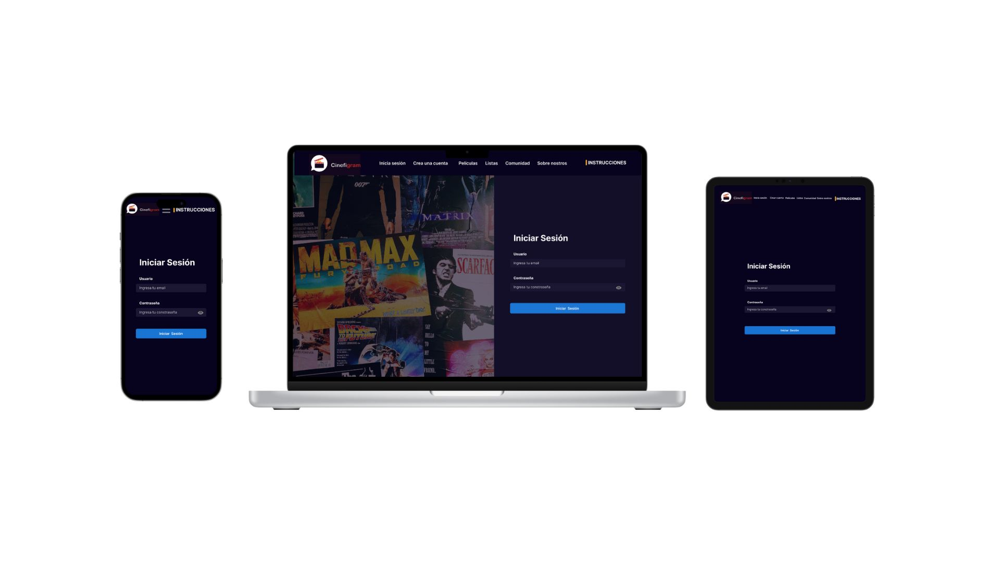

### Documento de diseño

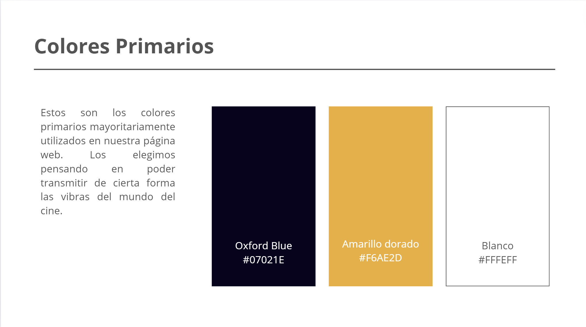

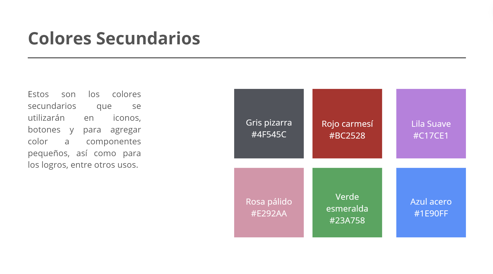

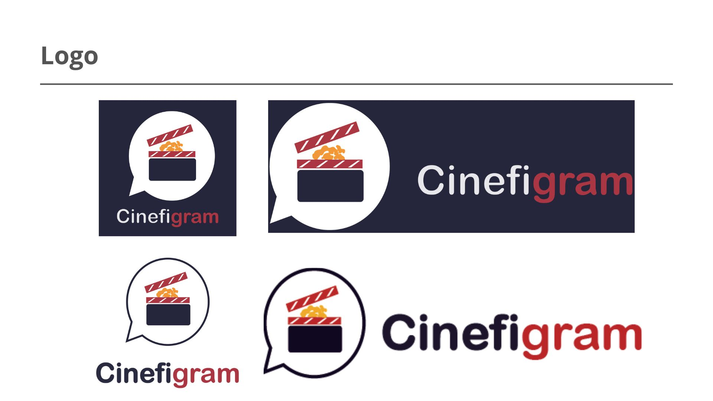

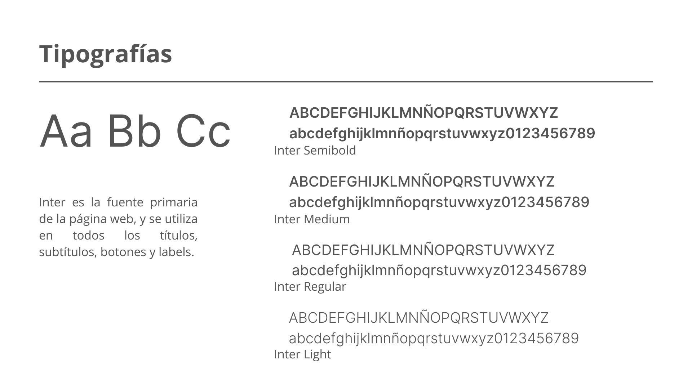

## Referencias

* Code Complete. (2023, June 22). Responsive Navbar in React using React Router | Beginner Tutorial [Video]. YouTube. https://www.youtube.com/watch?v=17l6AOc8s10 (routes en el navbar)

* Web Tech. (2022, December 28). ReactJS Like And Dislike Button | like button in react js  | Web Tech [Video]. YouTube. https://www.youtube.com/watch?v=mfaPBGJGxrE (componente likes)

* herdoycode. (2021, October 25). React navbar Tutorial Responsive Animated [Video]. YouTube. https://www.youtube.com/watch?v=ZJZVCg2lXSc (navbar responsivo)